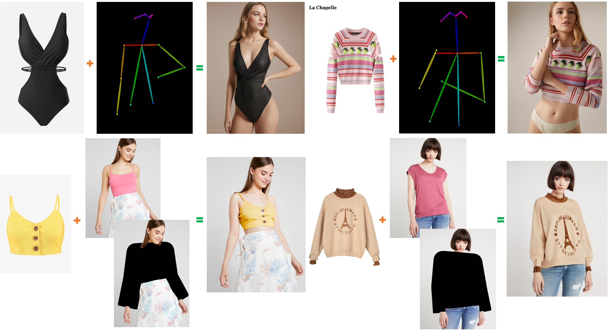
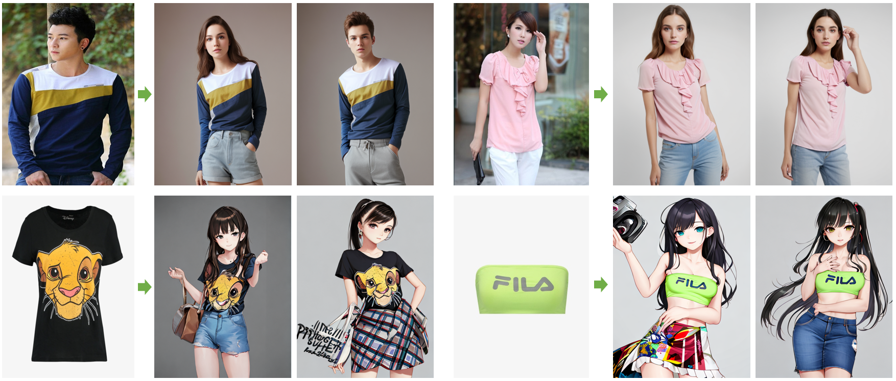

# oms-Diffusion
This repository is the official implementation of OMS-Diffusion

> **OMS-Diffusion: One More Step Diffusion is All You Need for Virtual Try-on**<br>

generative demo
&nbsp;

controlnet demo (openpose, inpainting)
&nbsp;

some unexpected funny application (need more effort)
&nbsp;

## Tips
本项目致力于协助中小服装商家解决约拍模特导致的高昂成本问题。
只需一张服装图片，可以生成各种身穿该服装的模特。
后期也会为个人用户提供服装试穿功能。
> This project is committed to assisting small-sized clothing businesses in solving the high cost problem caused by model appointments.
> With just one clothing image, various models wearing that clothing can be generated
> In the later stage, it will also be provided for individual users for picking suitable garment.


## Guidance
1、默认的提示词是"a photography of a model", 你可以通过增加词汇像 "sunglasses" 或者 "red skirt" 来设定模特，或者把"model"换成"man"来指定性别，但是作者也不清楚它对最终的试衣结果有何影响。

The default prompt is "a photography of a model". You can add words like "sunglasses", "red skirt" or change "model" to "man" to specify the model, but we do not know how it will affect the final result.

2、512权重的默认的图像分辨率是（512，384），此分辨率可能会生成扭曲的面部。你可以增加图像分辨率来获得优秀的细节，但是有些情况会导致衣服失控,需要多次尝试不同随机种子才能得到较好的结果。

The default image resolution for 512 weights is (512,384), which may generate distorted faces. You can increase the image resolution to obtain excellent details, but in some cases, it can lead to clothing losing control.

3、如果你发现衣服细节和你期望的对应不上，请尝试不同的随机种子。

If you find that the details of the clothes do not match your expectations, please try different random seeds.

4、guidance Scale来控制试衣服装的强度，但较大的值会导致图像失真。推荐2.0左右。

Guidance Scale is used to control the strength of clothes, but larger values may cause image distortion. (1.0 , 3.0) may be a good interval.

5、本项目内置了一个将服装从背景分离出来的权重，但是它可能不是最优的，如果你有更好的权重，像[SAM](https://github.com/facebookresearch/segment-anything)，请替换它。

This project contains a module that separates clothing from the background, but it may not be optimal. if you have better weights like [SAM](https://github.com/facebookresearch/segment-anything). Please replace it.


Anyway, have fun with it.


## WEIGHTS
- [x] 512 resolution weights: [huggingface](https://huggingface.co/shinehugging/oms-diffusion) or [Baidu Driver](https://pan.baidu.com/s/1UJgARIfXyZz5AyLUWYEWgg?pwd=ae6f)

该权重是一个实验性质的版本，在VITON-HD一万多张训练集（女模特，上半身，夏装，4:3分辨率）上训练，所以它对某些颜色或类别可能有所偏好。训练分辨率为（512,384），对较小的字体可能会导致模糊变形（在高分辨率下已解决）。

This weight is an experimental model trained on over 10000 VITON-HD training images (female models, upper body, summer clothing, 4:3 resolution), so it may have preferences for certain colors or categories.The training resolution is (512,384) which may result in blurry deformation for smaller fonts (resolved at high resolutions).

- [ ] 768 resolution weights（maybe early March, if we get more stars）

我们在768分辨率上调优训练策略，增加模型分辨率，拓展衣服类别和模特类别，敬请期待。

We optimize the training strategy at 768 resolution, increase model resolution, and expand clothing and model categories. Stay informed with us! 


## Installation

1. Clone the repository

```sh
git clone https://github.com/chenshine1/oms-Diffusion.git
```

2. Create a conda environment and install the required packages

```sh
conda create -n oms-diffusion python==3.10
conda activate oms-diffusion
pip install torch==2.0.1 torchvision==0.15.2 numpy==1.25.1 diffusers==0.25.1 opencv-python==4.8.0  transformers==4.31.0 gradio==4.16.0 safetensors==0.3.1 controlnet-aux==0.0.6 accelerate-0.21.0
```

## Inference
1. python demo
```sh
python inference.py --cloth_path[your cloth path] --model_path[your model path]
```

2. gradio demo
```sh
python gradio_generate.py --model_path[your model path] 
```

## TODO List
- [x] Inference code
- [x] Gradio demo
- [x] Support Controlnet
- [ ] Support IP-adapter-faceid
- [x] Release 512 resolution weights
- [ ] Release 768 resolution weights
- [ ] Release 1024 resolution weight
- [ ] Support lower-body clothes
- [ ] Support full-body dresses
- [ ] Support SDXL
- [ ] Support InstantID
