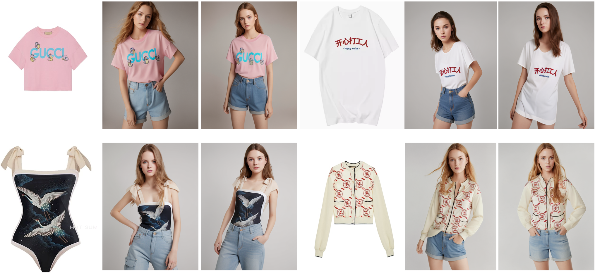

# oms-Diffusion
This repository is the official implementation of OMS-Diffusion

> **OMS-Diffusion: One More Step Diffusion is All You Need for Virtual Try-on**<br>
&nbsp;

## Tips
本项目致力于协助中小服装商家解决约拍模特导致的高昂成本问题。
只需一张服装图片，可以生成各种身穿该服装的模特。
后期也会为个人用户提供服装试穿功能。
> This project is committed to assisting small-sized clothing businesses in solving the high cost problem caused by model appointments.
> With just one clothing image, various models wearing that clothing can be generated
> In the later stage, it will also be provided for individual users for picking suitable garment.


## Installation

1. Clone the repository

```sh
git clone https://github.com/chenshine1/oms-Diffusion.git
```

2. Create a conda environment and install the required packages

```sh
conda create -n oms-diffusion python==3.10
conda activate oms-diffusion
pip install torch==2.0.1 torchvision==0.15.2 numpy==1.25.1 diffusers==0.25.1 opencv-python==4.8.0  transformers==4.31.0 gradio==4.16.0 safetensors==0.3.1 controlnet-aux==0.0.6 accelerate-0.21.0
```


## TODO List
- [x] Inference code
- [x] Gradio demo
- [x] Support Controlnet
- [ ] Support IP-adapter-faceid
- [ ] Support lower-body clothes
- [ ] Support full-body dresses
- [ ] Support SDXL
- [ ] Release (512,384) resolution weights
- [ ] Release (768,576) resolution weights
- [ ] Release (1024,768) resolution weight
