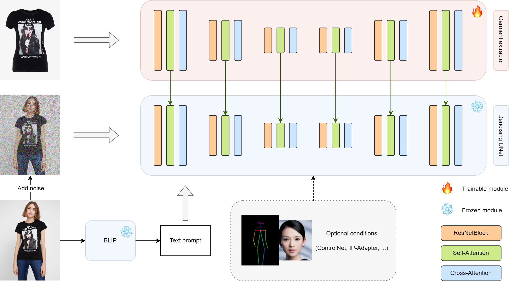

# Magic Clothing
This repository is the official implementation of Magic Clothing

Magic Clothing is a branch version of [OOTDiffusion](https://github.com/levihsu/OOTDiffusion), focusing on controllable garment-driven image synthesis

<!-- Please refer to our [previous paper](https://arxiv.org/abs/2403.01779) for more details -->

> **Magic Clothing: Controllable Garment-Driven Image Synthesis** [[arXiv paper](https://arxiv.org/abs/2404.09512)]<br>
> [Weifeng Chen](https://github.com/ShineChen1024)\*, [Tao Gu](https://github.com/T-Gu)\*, [Yuhao Xu](http://levihsu.github.io/)<sup>+</sup>, [Chengcai Chen](https://www.researchgate.net/profile/Chengcai-Chen)<br>
> \* Equal contribution <sup>+</sup> Corresponding author<br>
> Xiao-i Research

📢📢 We are continuing to improve this project. Please check [earlyAccess branch](https://github.com/ShineChen1024/MagicClothing/tree/earlyAccess) for new features and updates : )

## News

🔥 [2024/4/16] Our [paper](https://arxiv.org/abs/2404.09512) is available now!

🔥 [2024/3/8] We release the model weights trained on the 768 resolution. The strength of clothing and text prompts can be independently adjusted.

🤗 [Hugging Face link](https://huggingface.co/ShineChen1024/MagicClothing)

🔥 [2024/2/28] We support [IP-Adapter-FaceID](https://huggingface.co/h94/IP-Adapter-FaceID) with [ControlNet-Openpose](https://github.com/lllyasviel/ControlNet-v1-1-nightly) now! A portrait and a reference pose image can be used as additional conditions.

Have fun with ***gradio_ipadapter_openpose.py***

🔥 [2024/2/23] We support [IP-Adapter-FaceID](https://huggingface.co/h94/IP-Adapter-FaceID) now! A portrait image can be used as an additional condition.

Have fun with ***gradio_ipadapter_faceid.py***

&nbsp;
&nbsp;


## Installation

1. Clone the repository

```sh
git clone https://github.com/ShineChen1024/MagicClothing.git
```

2. Create a conda environment and install the required packages

```sh
conda create -n magicloth python==3.10
conda activate magicloth
pip install torch==2.0.1 torchvision==0.15.2 torchaudio==2.0.2
pip install -r requirements.txt
```

## Inference

1. Python demo

> 512 weights

```sh
python inference.py --cloth_path [your cloth path] --model_path [your model checkpoints path]
```

> 768 weights

```sh
python inference.py --cloth_path [your cloth path] --model_path [your model checkpoints path] --enable_cloth_guidance
```

2. Gradio demo

> 512 weights

```sh
python gradio_generate.py --model_path [your model checkpoints path] 
```

> 768 weights

```sh
python gradio_generate.py --model_path [your model checkpoints path] --enable_cloth_guidance
```

## Citation
```
@article{chen2024magic,
  title={Magic Clothing: Controllable Garment-Driven Image Synthesis},
  author={Chen, Weifeng and Gu, Tao and Xu, Yuhao and Chen, Chengcai},
  journal={arXiv preprint arXiv:2404.09512},
  year={2024}
}
```

## TODO List
- [x] Paper
- [x] Gradio demo
- [x] Inference code
- [x] Model weights
- [ ] Training code
